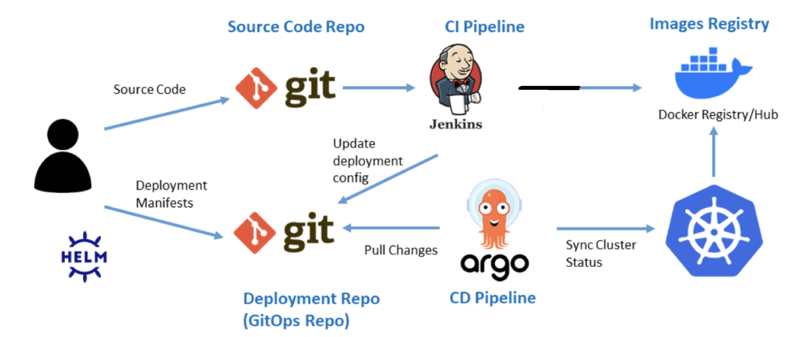
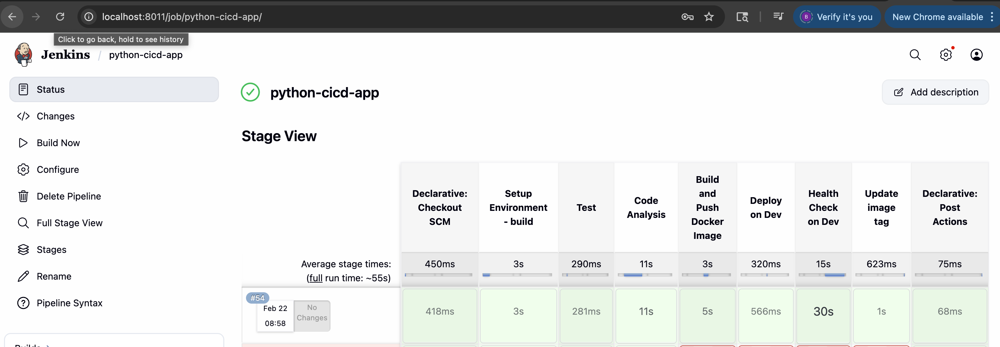
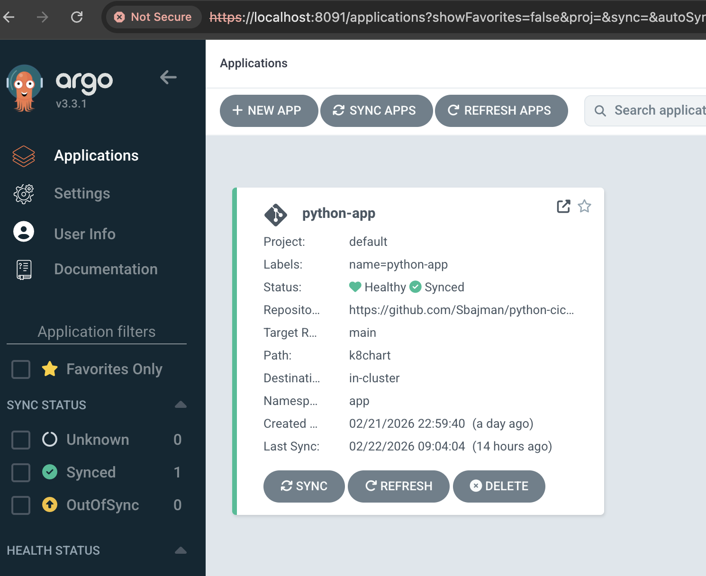

#### ULTIMATE-CICD-PIPELINE A GITOPS APPROACH for Continous delivery(Jenkins + ArgoCD + HELM + K8's)
End-to-end production-style CI/CD pipeline using GitOps principles, enabling automated build, containerization, and Kubernetes deployment with ArgoCD.


#### This project demonstrates a modern CI/CD architecture integrating:

* CI (Continuous Integration): Github, Jenkins, sonarqube, Dockerhub-registry.
* CD (Continuous Deployment): Github, Helm, ArgoCD (GitOps model)
* Containerization: Docker.
* Orchestration: Kubernetes (K8s, minikube/kind local testing)

The pipeline ensures that Git is the single source of truth, and all deployments are declarative, version-controlled, and automatically reconciled.

Summary:
CI builds artifacts and updates a GitOps repository, while CD is fully decoupled and driven by ArgoCD, enabling scalable, reusable pipelines across multiple services


## Architecture Diagram (Logical Flow)


<!-- ## CI/CD Pipeline
<details>
<summary>Logical Flow</summary> -->


#### Architecture Diagram:



#### Tech Stack
 * Python Application
 * Jenkins (CI Pipeline)
 * Docker (Containerization)
 * sonarqube ( Got python application better alternative are tools like trivy or Synk )
 * Kubernetes (minikube/Kind Cluster)
 * ArgoCD (GitOps CD) 
 * Helm / YAML manifests


#### CI/CD Workflow

🔹 CI (Jenkins)
* Code pushed to GitHub
* Jenkins pipeline triggers automatically
* Build Docker image
* Push image to container registry
* Update Kubernetes manifests (image tag)

🔹 CD (ArgoCD - GitOps)
* ArgoCD monitors Git repository
* Detects manifest changes
* Syncs desired state to Kubernetes
* Ensures self-healing + drift correction

#### Repository Structure
```
.
├── Dockerfile
├── Readme.md
├── app
│   ├── __init__.py
│   ├── main.py
│   └── math_utils.py
├── cicd
│   ├── cd
│   └── ci
├── k8chart
│   ├── Chart.yaml
│   ├── charts
│   ├── templates
│   └── values.yaml
├── pytest.ini
├── requirements.txt
├── sonar-project.properties
├── tests
    ├── __pycache__
    └── test_math_utils.py
```

The POC approach was to have CI and CD files in the same repo, They can architected to be in a different repository.

Proposed Production improvements:
To generalize the pipeline and to scale across multiple apps, Jenkins pipelines must be templated and reusable, not custom per app.
Key strategies: 1. Shared Libraries, 2. Parameterized Pipelines, 3. Standard Repo Contract (Every app repo should follow a structure) 4. GitOps Repo Standardization (One repo for all deployments) , Jenkins updates only 5. Avoid duplicating YAML Use: Helm charts OR Kustomize overlays , 6 Centralized Governance Enforce: security scans, naming conventions, tagging strategy.


#### Getting Started (Local Setup)
Prerequisites
* Docker
* K8s (Minikube, kind....etc)
* kubectl
* Jenkins, sonarqube (running locally on docker containers)
* ArgoCD (Deployed on the cluster)
* Container Registry (Dockerhub registry used in this pipeline )

```
# Run docker compose to start jenkins and sonarqube
docker compose up

# Configure Jenkins , 
1. add credentials for access to dockerhub registry
2. add access credentials for sonarqube
3. Add access to github 

# Add K8's secrets
1. Add Secrets for dockerhub token deployed in App namespace
2. Add github token secret in argocd namespace

( the above tokens are same as configured in Jenkins)

```




