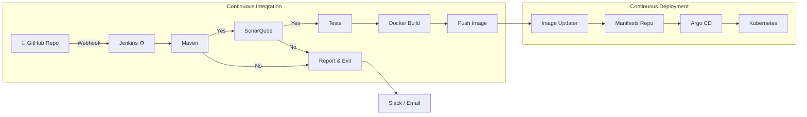

Utlimate-CICD-PILELINE A GITOPS APPROACH for Continous delivery

## Architecture

<!--  -->

## CI/CD Pipeline

Logical Flow

```mermaid
flowchart LR
    subgraph CI[Continuous Integration]
        A[🐙 GitHub Repo]
        A -->|Webhook| B[Jenkins ⚙️]
        B --> C[Maven]
        C -->|Yes| D[SonarQube]
        C -->|No| R[Report & Exit]
        D -->|Yes| E[Tests]
        D -->|No| R
        E --> F[Docker Build]
        F --> G[Push Image]
    end

    subgraph CD[Continuous Deployment]
        H[Image Updater]
        I[Manifests Repo]
        J[Argo CD]
        K[Kubernetes]
    end

    G --> H
    H --> I
    I --> J
    J --> K

    R --> N[Slack / Email]
```
